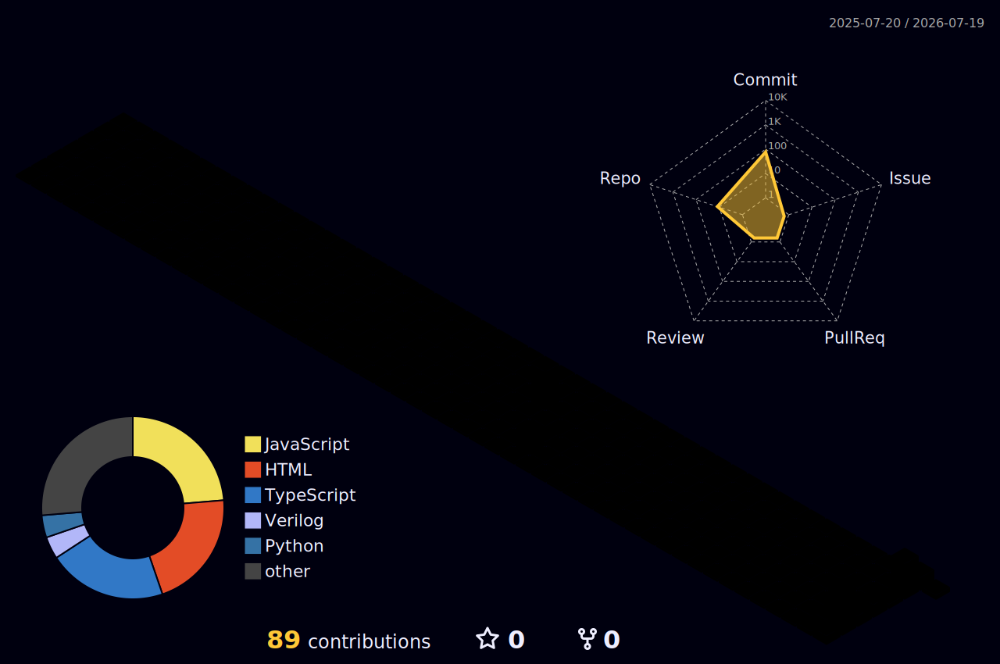

<picture>
  <source media="(prefers-color-scheme: dark)" srcset="https://readme-typing-svg.demolab.com?font=Inter&weight=800&size=36&duration=4000&pause=1000&color=F8FAFC&center=true&vCenter=true&width=600&height=70&lines=Hi%2C+I'm+Ritviz+Aggarwal;Electronics+Engineer;Software+Developer">
  <source media="(prefers-color-scheme: light)" srcset="https://readme-typing-svg.demolab.com?font=Inter&weight=800&size=36&duration=4000&pause=1000&color=0F172A&center=true&vCenter=true&width=600&height=70&lines=Hi%2C+I'm+Ritviz+Aggarwal;Electronics+Engineer;Software+Developer">
  
</picture>

*I am an electronics engineer and full-stack developer specializing in both low-level hardware design and modern software architectures. My expertise spans RTL design for FPGAs, multi-layer PCB routing, and the development of scalable web platforms and browser extensions.*

## My Toolkit

### Hardware & EDA Tools

### Languages

### Frameworks & Libraries

## Featured Projects

### Software Engineering

#### Web & App Platforms

<table>
  <tr>
    <td width="50%" valign="top">
      <h2><b><a href="https://github.com/Rizz-Vizz/Nabha-Sihata">Nabha-Sihata</a></b></h2>
      
A complete telemedicine platform bridging the gap for rural healthcare. Features AI symptom checking, offline access, and multilingual support.

      

        
        
        
        
      

    </td>
    <td width="50%" valign="top">
      <h2><b><a href="https://github.com/Rizz-Vizz/Campusthan">Campusthan</a></b></h2>
      
An automated placement cell platform with an AI-powered resume builder. Streamlines hiring with automated scheduling and verification.

      

        
        
        
        
      

    </td>
  </tr>
  <tr style="border: none; background: transparent;">
    <td colspan="2" style="padding: 0; border: none;"></td>
  </tr>
  <tr>
    <td width="50%" valign="top">
      <h2><b><a href="https://github.com/Rizz-Vizz/StockSwap">StockSwap</a></b></h2>
      
A B2B platform helping shopkeepers trade and liquidate dead inventory through hyperlocal swaps and discounted sales.

      

        
        
        
      

    </td>
    <td width="50%" valign="top" style="border: none; background: transparent;"></td>
  </tr>
</table>

#### Chrome Extensions

<table>
  <tr>
    <td width="50%" valign="top">
      <h2><b><a href="https://github.com/Rizz-Vizz/privacy-xray">privacy-xray</a></b></h2>
      
See exactly what your installed extensions can access and do. Everything is computed on your device — nothing is ever shared.

      

        
        
      

    </td>
    <td width="50%" valign="top">
      <h2><b><a href="https://github.com/Rizz-Vizz/StudySnap-Pro">StudySnap-Pro</a></b></h2>
      
The ultimate YouTube study companion. Snap frames, take rich notes, and organize everything completely locally.

      

        
        
      

    </td>
  </tr>
</table>

### Hardware Engineering

#### PCB Design & Embedded Systems

<table>
  <tr>
    <td width="50%" valign="top">
      <h2><b><a href="https://github.com/Rizz-Vizz/stm32f411-dev-board">stm32f411-dev-board</a></b></h2>
      
Custom 4-layer STM32F411 development board with an integrated MPU-6050 IMU. Full schematic capture, component selection, routing, and manufacturing files.

      

        
        
        
      

    </td>
    <td width="50%" valign="top">
      <h2><b><a href="https://github.com/Rizz-Vizz/LED-Chaser-PCB-Design">LED-Chaser-PCB-Design</a></b></h2>
      
Complete Altium Designer project for a classic LED chaser circuit — full schematic, PCB layout, and manufacturing files using a 555 Timer and CD4017.

      

        
        
        
      

    </td>
  </tr>
</table>

#### Digital Logic / RTL

<table>
  <tr>
    <td width="100%" valign="top">
      <h2><b><a href="https://github.com/Rizz-Vizz/Hardware-Neural-MAC">Hardware-Neural-MAC</a></b></h2>
      
Hardware implementation of a Neural Network MAC unit and ReLU activation, built entirely from Verilog logic gates without using any built-in operators — synthesized for FPGA.

      

        
        
        
        
        
      

    </td>
  </tr>
</table>

#### Signal Processing

<table>
  <tr>
    <td width="100%" valign="top">
      <h2><b><a href="https://github.com/Rizz-Vizz/dsp-platform">dsp-platform</a></b></h2>
      
Computational environment for rigorous manipulation and visualization of audio waveforms. Utilizes advanced Fourier transforms and phase vocoding algorithms for real-time spectral modification.

      

        
        
        
        
      

    </td>
  </tr>
</table>

## GitHub Activity

<picture>
  <source media="(prefers-color-scheme: dark)" srcset="./profile-3d-contrib/profile-night-rainbow.svg">
  <source media="(prefers-color-scheme: light)" srcset="./profile-3d-contrib/profile-green.svg">
  
</picture>

## Contact Me

